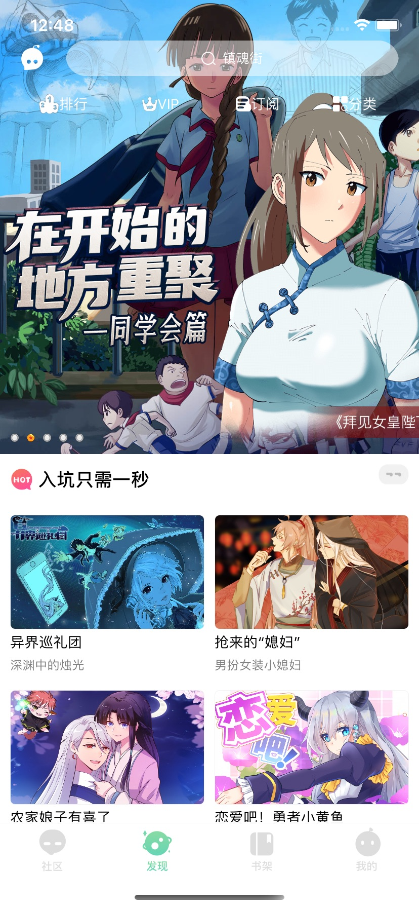
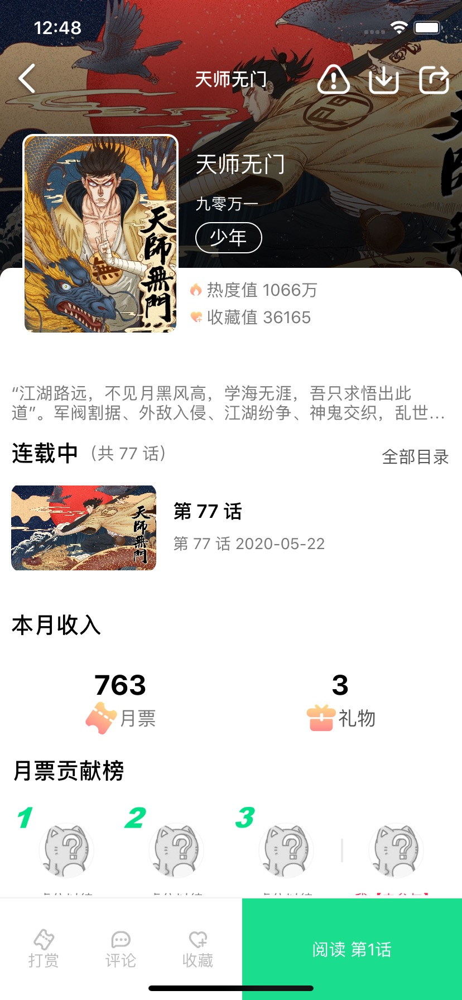
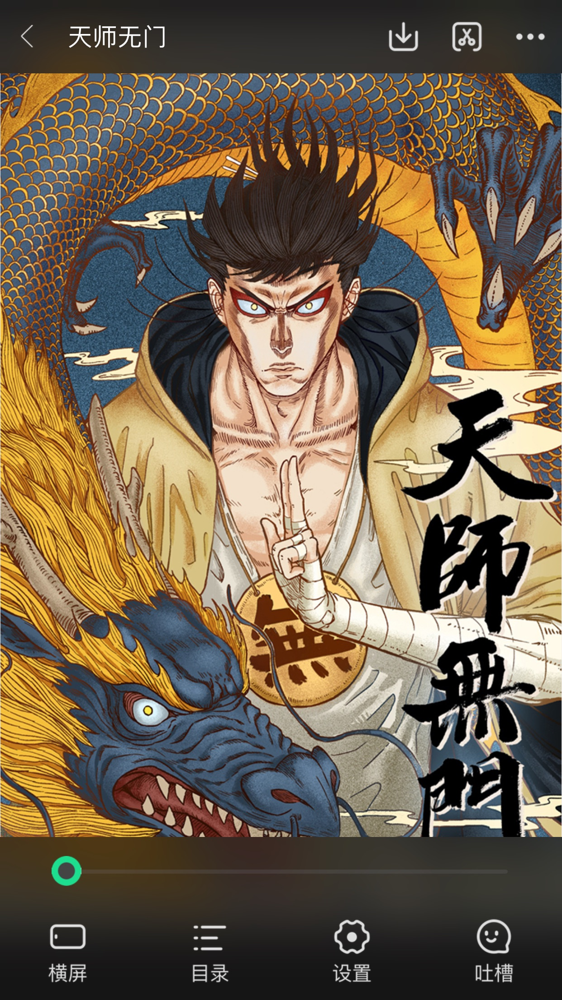

# U17 高仿有妖气漫画APP

#### 高仿有妖气漫画APP（Swift-V5.0版本）核心界面功能**

高仿有妖气漫画APP开发语言组件：Swift5(Moya+Alamofire、HandyJSON、Kingfisher、SnapKit、MJRefresh)

注：本项目基于旧版本重制界面、接口和功能。仅供Swift开发新手学习和借鉴。

##### 本项目已删除Pod源文件，Clone下来后麻烦自己pod install一下哈~

#### 项目截图
###### GIF

###### 1. 首页

###### 2. 漫画详情

###### 3. 漫画阅读

###### 4. 个人中心

####  5.更多 - More
- 如果您发现了bug请尽可能详细地描述系统版本、手机型号和复现步骤等信息 提一个issue.
- 如果您有什么好的建议也可以提issue,大家一起讨论一起学习进步...
- 具体代码请下载项目  如果觉得喜欢的能给一颗小星星么!  ✨ 
- [有兴趣可以加下创建的QQ群:812144991(因为工作很忙所以可能问问题没人回答!!)](//shang.qq.com/wpa/qunwpa?idkey=ebd8d6809c83b4d6b4a18b688621cb73ded0cce092b4d1f734e071a58dd37c26) 
- The MIT License (MIT)                  Copyright (c) 2018 KEENTEAM
